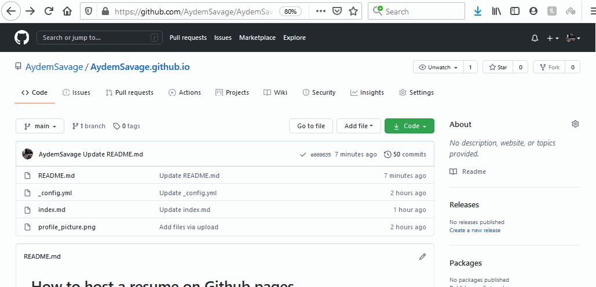

# How to host a resume on Github pages

This README will explain how to host your resume on Github and style it using Markdown and Jekyll. I will relate these steps to key concepts found in Andrew Etter's book _Modern Technical Writing_. I will explain how some of the steps we take here can be applied to make your technical writing better. So in the end, you will hopefully learn both concepts in modern technical writing and how to apply them.

## Prerequisites

In the hopes of keeping this tutorial from being too long-winded, I require you to come with 2 things:

1. A resume formatted in Markdown
2. A Github account

If you do not already have both of these things, you can check out the [More Resources](#More-Resources) section for links to where you can get both of these.

## Step 1 - Create a repository

There are several ways of creating a new repository. One option is doing it from the main page, the other is being on your account page and selecting the `Repositories` header. From there you will:

1. Click the green **`New`** button on the top of the page.
2. Name the repository **`username.github.io`** where `username` would be your account name.
3. (optional) Add a description that briefly summarizes what this repository is about.
4. Check **`Public`**.
5. Check **`Add a README`**.
6. Click **`Create repository`**.

Andrew Etter strongly advocates for the use of distributed version control systems (DVCS) such as Github as opposed to centralized systems. This is because DVCS allow us to:

* concurrently work on the same file as other people;
* work offline, keeping the changes locally until you are able to upload them;
* keep a log of what has changed in every file and what time in your project;
* publicly share your project so that others can contribute.

## Step 2 - Adding your resume

Once you are in your repository, you can now add your Markdown formatted resume.

1. Click the **`Add file`** dropdown and select **`Create new file`**.
2. Name the file **`index.md`**.
3. Copy and paste your Markdown formatted resume into the space provided.
4. Click the green **`Commit new file`** button at the bottom of the page.

Using a lightweight markup language such as Markdown has many advantages over other markup languages such as Word or XML. For instance, Andrew Etter mentions that Markdown is still very readable in its raw format, which cannot be said the same about XML. This is because XML requires you to provide tags that will organize the page but can quickly get out of hand, even on simple documents.

Word is good for making resumes that you will print but awful for anything that has to be kept up to date. This is because when you use Word, you are forced to convert it to a PDF since its raw format is not supported in many places. Then you will need to upload this PDF to your Github or wherever else you choose. But with Markdown, you can simply update your file directly on Github without needing to reupload it.

## Step 3 - Format website using Jekyll

Jekyll is one of the most popular static website generators at the moment. And we will use it to create a beautiful looking website with just a few clicks.

1. From your resume repository, Select the **`Settings`** tab on the top of the page.
2. Scroll down until you see the **`GitHub Pages`** section.
3. Click **`Change Theme`**.
4. Select one of the themes that you like best by clicking its thumbnail at the top of the page
5. Click **`Select theme`** to apply it to our Github page

Due to Githubs integration of Jekyll, you are able to easily style your website without too much hassle. Jekyll also offers much more power and customizability than is mentioned here. A link to resources will be provided in the [More Resources](#More-Resources) section if you are interested in customizing your website further.

Andrew Etter explains how static websites are fast, simply and secure. When what we are hosting is not very complicated, such as a resume in this case, static sites allow us to quickly create a great looking page that is easy to read and very easy to maintain. Since we are using Markdown for our resume, we can easily make changes to our resume and the next time we load our website, the website automatically rebuilds and displays the most recent version of our resume.

## Step 4 - Check your website
Congratulations! You're all done. You can now check to see it your website is up and looks the way you want it to. All you need to do is type **`username.github.io`**, where `username` would be your account name, into your web browser. Now you should be looking at your resume formatted using Markdown and Jekyll.

### More Resources

1. [Markdown tutorial](https://www.markdowntutorial.com/)
2. [Creating a Github account](https://github.com/join)
3. [Modern Technical Writing](https://www.amazon.ca/Modern-Technical-Writing-Introduction-Documentation-ebook/dp/B01A2QL9SS) by Andrew Etter
4. [Jekyll tutorial](https://www.youtube.com/watch?v=T1itpPvFWHI)

## Authors and Acknowledgments

Adam Azarov

# FAQs

Why is Markdown better than a word processor?
Better because we are able to easily update our resume without having to convert the work file to HTML or PDF and then upload that. We can easily update our website

| # | Question | Answer |
|---|---|---|
| 1 | Why is Markdown better than a word processor? | Markdown is better than a word processor because you are able to easily update your resume/website without having to convert the file (into XML or a PDF) and then upload it. You can easily update the Markdown file by editing it on your Github page |
| 2 | Why is my resume not showing up? | There could a few things wrong. Please check the following. 1) Check if your repository is Public. 2) Check to see that you have named your resume `index.md`. 3) Check that you named your repository **username.github.io** where **username** is your account name. 4) Check to see that you're searching for the correct address, you need to search for **username.github.io** |
